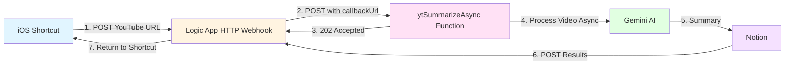

# Azure Logic Apps Webhook Setup Guide

This guide explains how to set up **Azure Logic Apps with HTTP Webhook** to integrate with your YouTube Video Summarizer function, eliminating timeout issues with iOS Shortcuts.

## Why Use Logic Apps with Webhook?

**Problem:** iOS Shortcuts has a ~2 minute timeout limit, but video summarization can take 3-10 minutes for long videos.

**Solution:** Azure Logic Apps with HTTP Webhook provides:
- ✅ **No Timeout Issues**: Logic Apps can wait indefinitely for completion
- ✅ **Async Processing**: Function returns immediately (202 Accepted)
- ✅ **Automatic Callbacks**: Results delivered when ready
- ✅ **iOS Shortcuts Compatible**: Easy integration with Shortcuts app
- ✅ **Email Notifications**: Get notified when processing completes
- ✅ **Retry Logic**: Built-in retry capabilities

---

## Architecture Overview



**Flow:**
1. iOS Shortcut sends YouTube URL to Logic App
2. Logic App calls Azure Function with webhook callback URL
3. Function returns 202 Accepted immediately (no timeout)
4. Function processes video in background (3-10 minutes)
5. Function posts results to Logic App callback URL
6. Logic App returns results to iOS Shortcut

---

## Prerequisites

- Azure Subscription
- Azure Function App deployed with `ytSummarizeAsync` endpoint
- iOS device with Shortcuts app
- Function access key (ADMIN level)

---

## Setup Steps

### 1. Create Azure Logic App

```powershell
# Set variables
$resourceGroup = "your-resource-group"
$location = "eastus"
$logicAppName = "yt-summarizer-webhook"

# Create Logic App
az logic workflow create `
  --resource-group $resourceGroup `
  --location $location `
  --name $logicAppName `
  --definition "@logic-app-workflow.json"
```

Or create manually in Azure Portal:

1. Go to [Azure Portal](https://portal.azure.com)
2. Click **Create a resource** → Search for **Logic App**
3. Click **Create**
4. Fill in:
   - **Name**: `yt-summarizer-webhook`
   - **Resource Group**: Select your resource group
   - **Region**: Same as your Function App
   - **Plan type**: Consumption (pay-per-execution)
5. Click **Review + Create** → **Create**

---

### 2. Configure Logic App Workflow

#### Step 1: Add HTTP Webhook Trigger

1. Open your Logic App in Azure Portal
2. Click **Logic app designer**
3. Search for **HTTP Webhook** trigger
4. Configure:
   - **Method**: POST
   - **Subscribe - URI**: `https://<your-function-app>.azurewebsites.net/api/ytSummarizeAsync?code=<function-key>`
   - **Subscribe - Body**: 
     ```json
     {
       "url": "@{triggerBody()?['url']}",
       "callbackUrl": "@{listCallbackUrl()}"
     }
     ```
   - **Subscribe - Headers**:
     ```json
     {
       "Content-Type": "application/json"
     }
     ```

#### Step 2: Add Response Action

1. Click **+ New step**
2. Search for **Response**
3. Configure:
   - **Status Code**: `200`
   - **Body**:
     ```json
     {
       "status": "@{body('HTTP_Webhook')?['status']}",
       "youtube_url": "@{body('HTTP_Webhook')?['youtube_url']}",
       "notion_url": "@{body('HTTP_Webhook')?['notion_url']}",
       "message": "@{body('HTTP_Webhook')?['message']}"
     }
     ```

4. Click **Save**

---

### 3. Get Logic App Webhook URL

After saving:

1. Click **Run Trigger** → **Manual**
2. Copy the **HTTP POST URL** that appears
3. This is your Logic App webhook endpoint

Or get it via CLI:

```powershell
# Get callback URL
az logic workflow show `
  --resource-group $resourceGroup `
  --name $logicAppName `
  --query "accessEndpoint" `
  --output tsv
```

---

### 4. Create iOS Shortcut

#### Option A: Import Pre-Built Shortcut

Download the shortcut: [YouTube to Notion (Webhook)](./shortcuts/YouTube-to-Notion-Webhook.shortcut)

Then customize:
1. Open Shortcuts app
2. Long-press the shortcut → **Edit**
3. Find the **Get Contents of URL** action
4. Replace the URL with your Logic App webhook URL

#### Option B: Create Manually

1. Open **Shortcuts** app on iPhone/iPad
2. Tap **+** to create new shortcut
3. Add actions in this order:

**Action 1: Get Input**
- Search for "Get URLs from Input"
- This captures shared YouTube URLs

**Action 2: Get Contents of URL**
- Search for "Get Contents of URL"
- Configure:
  - **URL**: `<your-logic-app-webhook-url>`
  - **Method**: POST
  - **Request Body**: JSON
    ```json
    {
      "url": "<URL from Input>"
    }
    ```
  - **Headers**: 
    - `Content-Type`: `application/json`

**Action 3: Show Notification**
- Search for "Show Notification"
- Configure:
  - **Title**: "Processing Video"
  - **Body**: "Your video is being summarized. You'll receive an email when complete."

4. Name your shortcut: "Summarize to Notion"
5. Tap **Done**

---

### 5. Enable Share Sheet Integration

1. Open the shortcut you created
2. Tap the **ⓘ** (info) button
3. Enable **Show in Share Sheet**
4. Under **Share Sheet Types**, enable:
   - ✅ URLs
5. Tap **Done**

Now you can summarize videos directly from the YouTube app!

---

## Testing

### Test 1: From iOS Shortcuts App

1. Open Shortcuts app
2. Find your "Summarize to Notion" shortcut
3. Tap it
4. Paste a YouTube URL when prompted
5. You should see:
   - ✅ "Processing Video" notification immediately
   - ✅ Function starts processing in background
   - ✅ Email notification when complete (~3-10 minutes)

### Test 2: From YouTube App

1. Open YouTube app
2. Find a video to summarize
3. Tap **Share** button
4. Tap **Shortcuts**
5. Select "Summarize to Notion"
6. Video processes in background
7. Receive email when complete

### Test 3: Monitor Logic App

1. Go to Azure Portal → Your Logic App
2. Click **Overview** → **Runs history**
3. You should see:
   - Status: **Running** (while processing)
   - Status: **Succeeded** (after completion)
4. Click on a run to see detailed execution

---

## Logic App Workflow JSON

Save this as `logic-app-workflow.json` for automated deployment:

```json
{
  "definition": {
    "$schema": "https://schema.management.azure.com/providers/Microsoft.Logic/schemas/2016-06-01/workflowdefinition.json#",
    "actions": {
      "Response": {
        "inputs": {
          "body": {
            "message": "@body('HTTP_Webhook')?['message']",
            "notion_url": "@body('HTTP_Webhook')?['notion_url']",
            "status": "@body('HTTP_Webhook')?['status']",
            "youtube_url": "@body('HTTP_Webhook')?['youtube_url']"
          },
          "statusCode": 200
        },
        "kind": "Http",
        "runAfter": {
          "HTTP_Webhook": [
            "Succeeded"
          ]
        },
        "type": "Response"
      }
    },
    "contentVersion": "1.0.0.0",
    "outputs": {},
    "parameters": {},
    "triggers": {
      "manual": {
        "inputs": {
          "schema": {
            "properties": {
              "url": {
                "type": "string"
              }
            },
            "type": "object"
          }
        },
        "kind": "Http",
        "type": "Request"
      }
    }
  }
}
```

---

## Advanced Configuration

### Add Retry Logic

In Logic App Designer:

1. Click the **HTTP Webhook** action
2. Click **⋯** (three dots) → **Settings**
3. Configure retry policy:
   - **Type**: Exponential Interval
   - **Count**: 3
   - **Interval**: PT10S
   - **Minimum**: PT10S
   - **Maximum**: PT1H

### Add Error Notifications

1. After HTTP Webhook action, click **+ New step**
2. Search for **Condition**
3. Configure:
   - **Value**: `@body('HTTP_Webhook')?['status']`
   - **Is equal to**: `error`
4. In **True** branch, add email notification

### Add Logging

1. After HTTP Webhook action, click **+ New step**
2. Search for **Create or update table row**
3. Connect to Azure Storage or Log Analytics
4. Log execution details for tracking

---

## Troubleshooting

### Shortcut Shows "Processing Video" but Nothing Happens

**Cause:** Logic App webhook URL incorrect or Function not accessible

**Solution:**
1. Verify Logic App URL in shortcut
2. Test Function directly:
```powershell
$body = @{ 
    url = "https://www.youtube.com/watch?v=dQw4w9WgXcQ"
    callbackUrl = "https://webhook.site/your-test-url"
} | ConvertTo-Json

Invoke-RestMethod -Uri "https://<function-app>.azurewebsites.net/api/ytSummarizeAsync?code=<key>" `
  -Method Post `
  -Body $body `
  -ContentType "application/json"
```

### Logic App Times Out

**Cause:** Function webhook callback not working

**Solution:**
1. Check Function logs for callback errors
2. Verify callback URL is reachable
3. Ensure Function has outbound internet access

### No Email Notification Received

**Cause:** Email service not configured

**Solution:**
1. Verify `EMAIL_FROM` and `EMAIL_TO` in Function App settings
2. Check Azure Communication Services configuration
3. Look for email errors in Function logs

---

## Cost Considerations

**Logic Apps Consumption Plan:**
- $0.000025 per execution
- First 4,000 executions/month free

**For this application:**
- Each video = 1 Logic App execution
- **Cost:** $0 for typical usage (within free tier)

---

## Security Best Practices

✅ **DO:**
- Use HTTPS for all webhook URLs
- Store Function keys in iOS Shortcuts (they're encrypted)
- Use ADMIN auth level for Function endpoints
- Monitor Logic App runs for suspicious activity

❌ **DON'T:**
- Don't share Logic App webhook URLs publicly
- Don't commit Function keys to source control
- Don't disable authentication on Function endpoints

---

## Alternative: Direct Async Endpoint (No Logic Apps)

If you don't want to use Logic Apps, you can call the `ytSummarizeAsync` endpoint directly:

### iOS Shortcut (Direct)

```
URL: https://<function-app>.azurewebsites.net/api/ytSummarizeAsync?code=<function-key>
Method: POST
Body: { "url": "<YouTube URL>" }
```

**Note:** You won't get results back in the shortcut, but you'll receive an email when complete.

---

## Next Steps

- ✅ Webhook integration complete - no more timeout issues!
- 📖 See [APP_CONFIG_SETUP.md](./APP_CONFIG_SETUP.md) for configuration management
- 📖 See [NOTION_SETUP.md](./NOTION_SETUP.md) for Notion integration details

---

## Additional Resources

- [Azure Logic Apps Documentation](https://learn.microsoft.com/azure/logic-apps/)
- [HTTP Webhook Trigger](https://learn.microsoft.com/azure/connectors/connectors-native-webhook)
- [iOS Shortcuts Documentation](https://support.apple.com/guide/shortcuts/welcome/ios)
- [webhook.site](https://webhook.site) - Test webhook callbacks
