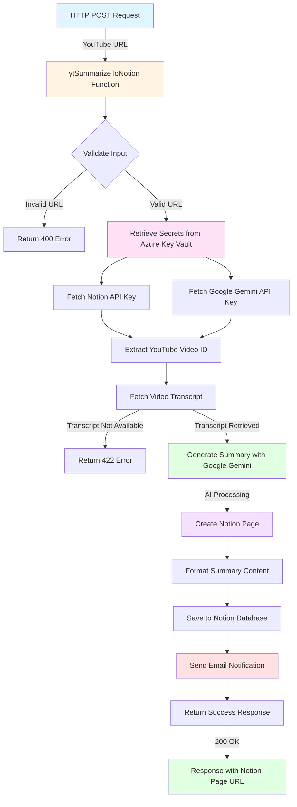

# YouTube Video Summarizer to Notion

An **Azure Functions** application built with **Python** that automatically summarizes YouTube videos using AI and saves the summaries to Notion, with email notification upon successful completion.

## Overview

This serverless application processes YouTube videos by:
1. Extracting video transcripts
2. Generating AI-powered summaries using Google Gemini
3. Creating organized Notion pages with the summary
4. Sending email notifications when complete

**Repository:** [rpabonnie/ytVideoSummarizeAzureFunctions](https://github.com/rpabonnie/ytVideoSummarizeAzureFunctions)  
**Runtime:** Python 3.13  
**Framework:** Azure Functions v2 Programming Model

---

## Function Workflow



---

## Features

- **🎥 YouTube Integration**: Automatically fetches video transcripts
- **🤖 AI Summarization**: Uses Google Gemini for intelligent content summarization
- **📝 Notion Integration**: Creates structured pages in your Notion workspace
- **📧 Email Notifications**: Sends confirmation emails upon successful processing
- **🔐 Secure**: Secrets managed via Azure Key Vault
- **☁️ Serverless**: Scales automatically with Azure Functions
- **🔍 Comprehensive Logging**: Application Insights integration for monitoring

---

## Prerequisites

- **Python 3.13**
- **Azure Subscription**
- **Azure Functions Core Tools**
- **Notion API Key** (Integration token)
- **Google Gemini API Key**
- **Azure Key Vault** (for secret management)

---

## Local Development Setup

### 1. Clone the Repository
```powershell
git clone https://github.com/rpabonnie/ytVideoSummarizeAzureFunctions.git
cd ytVideoSummarizeAzureFunction
```

### 2. Create Virtual Environment
```powershell
python -m venv venv
.\venv\Scripts\Activate.ps1
```

### 3. Install Dependencies
```powershell
pip install -r requirements.txt
```

### 4. Configure Local Settings
Create or update `local.settings.json`:
```json
{
  "IsEncrypted": false,
  "Values": {
    "AzureWebJobsStorage": "UseDevelopmentStorage=true",
    "FUNCTIONS_WORKER_RUNTIME": "python",
    "KEY_VAULT_URL": "https://your-keyvault.vault.azure.net/"
  }
}
```

### 5. Configure Azure Key Vault
Store secrets in Azure Key Vault:
```powershell
az keyvault secret set --vault-name <keyvault-name> --name "NOTION-API-KEY" --value "<your-notion-key>"
az keyvault secret set --vault-name <keyvault-name> --name "GOOGLE-API-KEY" --value "<your-gemini-key>"
```

### 6. Run Locally
```powershell
func host start
```

---

## API Usage

### Endpoint
```
POST http://localhost:7071/api/ytSummarizeToNotion
```

### Request Body
```json
{
  "url": "https://www.youtube.com/watch?v=VIDEO_ID"
}
```

### Example Request (PowerShell)
```powershell
$body = @{ url = "https://www.youtube.com/watch?v=dQw4w9WgXcQ" } | ConvertTo-Json
Invoke-RestMethod -Uri "http://localhost:7071/api/ytSummarizeToNotion" `
  -Method Post `
  -Body $body `
  -ContentType "application/json"
```

### Success Response
```json
{
  "status": "success",
  "notion_url": "https://notion.so/page-id",
  "email_sent": true
}
```

---

## Project Structure

```
ytVideoSummarizeAzureFunction/
├── function_app.py              # Main Azure Function definitions
├── host.json                    # Function host configuration
├── local.settings.json          # Local development settings (not committed)
├── requirements.txt             # Python dependencies
├── README.md                    # This file
├── QUICKSTART.md               # Quick start guide
├── TESTING.md                  # Testing documentation
├── context/
│   └── agent.md                # Agent instructions and guidelines
└── services/                   # Service layer (planned)
    ├── youtube_service.py      # YouTube API interactions
    ├── summarizer.py           # AI summarization logic
    ├── notion_service.py       # Notion API interactions
    └── email_service.py        # Email notification service
```

---

## Deployment

### Deploy to Azure
```powershell
# Login to Azure
az login

# Deploy the function app
func azure functionapp publish <your-function-app-name>
```

### Configure Production Settings
```powershell
# Set Key Vault URL
az functionapp config appsettings set `
  --name <app-name> `
  --resource-group <rg-name> `
  --settings "KEY_VAULT_URL=https://<keyvault-name>.vault.azure.net/"

# Enable Managed Identity
az functionapp identity assign `
  --name <app-name> `
  --resource-group <rg-name>

# Grant Key Vault access
az keyvault set-policy `
  --name <keyvault-name> `
  --object-id <function-app-identity> `
  --secret-permissions get list
```

---

## Security

- ✅ Secrets stored in **Azure Key Vault** (never in code)
- ✅ **Managed Identity** for secure Key Vault access
- ✅ **ADMIN auth level** for function endpoints
- ✅ Input validation and sanitization
- ✅ HTTPS-only communication in production

---

## Monitoring

- **Application Insights** enabled for telemetry
- Function execution tracking
- Error and exception logging
- Performance metrics
- Token usage monitoring for AI services

---

## Dependencies

Key packages (see `requirements.txt` for full list):
- `azure-functions` - Azure Functions runtime
- `youtube-transcript-api` - YouTube transcript extraction
- `google-generativeai` - Google Gemini AI integration
- `notion-client` - Notion API client
- `azure-identity` - Azure authentication
- `azure-keyvault-secrets` - Key Vault integration

---

## Error Handling

The function handles various error scenarios:
- **400**: Invalid YouTube URL
- **404**: Video not found or private
- **422**: Transcript unavailable
- **401**: API authentication issues
- **500**: Internal processing errors
- **429**: Rate limit exceeded

---

## Contributing

1. Fork the repository
2. Create a feature branch (`git checkout -b feature/amazing-feature`)
3. Commit your changes (`git commit -m 'Add amazing feature'`)
4. Push to the branch (`git push origin feature/amazing-feature`)
5. Open a Pull Request

---

## License

This project is licensed under the MIT License.

---

## Resources

- [Azure Functions Python Guide](https://learn.microsoft.com/azure/azure-functions/functions-reference-python)
- [Azure Key Vault Documentation](https://learn.microsoft.com/azure/key-vault/)
- [Notion API Documentation](https://developers.notion.com/)
- [Google Gemini API Documentation](https://ai.google.dev/docs)
- [YouTube Transcript API](https://pypi.org/project/youtube-transcript-api/)

---

## Contact

For questions or support, please open an issue in the GitHub repository.

**Last Updated:** November 16, 2025
