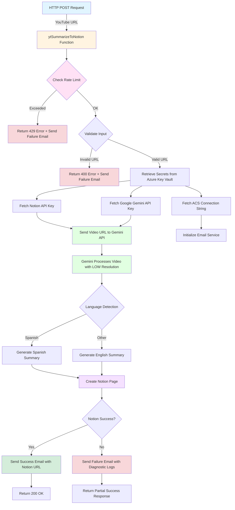

# YouTube Video Summarizer to Notion

An **Azure Functions** application built with **Python** that automatically summarizes YouTube videos using AI and saves the summaries to Notion, with comprehensive email notifications for both success and failure events.

## Overview

This serverless application processes YouTube videos by:
1. Validating and rate-limiting incoming requests (30 requests/hour during development)
2. Sending YouTube URLs directly to Google Gemini for native video processing
3. Generating AI-powered summaries with automatic language detection (Spanish/English)
4. Creating organized Notion pages with structured content and metadata
5. Sending comprehensive email notifications via Azure Communication Services for both success and failure events

**Repository:** [rpabonnie/ytVideoSummarizeAzureFunctions](https://github.com/rpabonnie/ytVideoSummarizeAzureFunctions)  
**Runtime:** Python 3.13  
**Framework:** Azure Functions v2 Programming Model

---

## Function Workflow



---

## Features

- **🎥 YouTube Integration**: Processes videos directly via URL using Gemini's native video capabilities
- **🤖 AI Summarization**: Uses Google Gemini 2.5 Pro for intelligent video analysis and summarization
- **🌍 Multi-Language Support**: Automatic language detection - Spanish videos get Spanish summaries, others get English
- **📝 Notion Integration**: Creates beautifully structured pages in your Notion workspace with tags, summaries, and metadata
- **📧 Email Notifications**: Comprehensive notifications via Azure Communication Services
  - Success emails with summary preview and Notion page link
  - Failure emails with detailed diagnostic logs and markdown attachments
  - Captures complete request context, stack traces, and runtime logs
- **⏱️ Rate Limiting**: Built-in rate limiting (30 requests/hour) to manage API costs during development
- **🔐 Secure**: All secrets managed via Azure Key Vault with Managed Identity authentication
- **☁️ Serverless**: Scales automatically with Azure Functions
- **🔍 Comprehensive Logging**: Application Insights integration for monitoring
- **⚙️ Centralized Configuration**: Azure App Configuration for easy settings management
- **📱 iOS Shortcuts Compatible**: Async webhook endpoint prevents timeout issues
- **🔄 Async Processing**: Background processing with webhook callbacks
- **🔍 Comprehensive Logging**: Application Insights integration with structured log capture for failure analysis

---

## Prerequisites

- **Python 3.13**
- **Azure Subscription**
- **Azure Functions Core Tools**
- **Google Gemini API Key**
- **Notion Account** (with integration created)
- **Azure Key Vault** (for secret management)
- **Azure Communication Services** (for email notifications)

---

## Local Development Setup

### 1. Clone the Repository
```powershell
git clone https://github.com/rpabonnie/ytVideoSummarizeAzureFunctions.git
cd ytVideoSummarizeAzureFunctions
```

### 2. Create Virtual Environment
```powershell
python -m venv venv
.\venv\Scripts\Activate.ps1
```

### 3. Install Dependencies
```powershell
pip install -r requirements.txt
```

### 4. Configure Local Settings
Create or update `local.settings.json`:
```json
{
  "IsEncrypted": false,
  "Values": {
    "AzureWebJobsStorage": "UseDevelopmentStorage=true",
    "FUNCTIONS_WORKER_RUNTIME": "python",
    "KEY_VAULT_URL": "https://your-keyvault.vault.azure.net/"
  }
}
```

### 5. Configure Azure Key Vault
Store secrets in Azure Key Vault:
```powershell
# Store Gemini API Key
az keyvault secret set --vault-name <keyvault-name> --name "GOOGLE-API-KEY" --value "<your-gemini-key>"

# Store Notion API Key
az keyvault secret set --vault-name <keyvault-name> --name "NOTION-API-KEY" --value "<your-notion-key>"

# Store Azure Communication Services Connection String
az keyvault secret set --vault-name <keyvault-name> --name "ACS-CONNECTION-STRING" --value "<your-acs-connection-string>"
```

### 6. Configure Notion Integration
Set up Notion database and configuration:
```powershell
# Copy example configuration
Copy-Item notion_config.example.json notion_config.json

# Edit notion_config.json with your database ID
# See NOTION_SETUP.md for detailed instructions
```

📖 **[Complete Notion Setup Guide](./NOTION_SETUP.md)**

### 7. (Optional) Configure Azure App Configuration

For centralized configuration management without redeployment:

```powershell
# See APP_CONFIG_SETUP.md for complete instructions
# This allows you to update Notion settings without redeploying
```

📖 **[Azure App Configuration Setup Guide](./APP_CONFIG_SETUP.md)**

### 7a. Configure Email Notifications (Optional)

Email notifications are optional but recommended for production use:

```powershell
# Set up Azure Communication Services Email Domain
# Then add environment variables to local.settings.json:
# EMAIL_FROM: Your verified sender email address
# EMAIL_TO: Recipient email address for notifications
```

### 8. Run Locally
```powershell
func host start
```

---

## API Usage

### Endpoint 1: Synchronous Processing

**For:** API calls, testing, quick responses

```
POST http://localhost:7071/api/ytSummarizeToNotion
```

#### Request Body
```json
{
  "url": "https://www.youtube.com/watch?v=VIDEO_ID"
}
```

### Example Request (PowerShell)
```powershell
$body = @{ url = "https://www.youtube.com/watch?v=dQw4w9WgXcQ" } | ConvertTo-Json
Invoke-RestMethod -Uri "http://localhost:7071/api/ytSummarizeToNotion" `
  -Method Post `
  -Body $body `
  -ContentType "application/json"
```

### Success Response
```json
{
  "status": "success",
  "message": "Video summarized successfully",
  "youtube_url": "https://www.youtube.com/watch?v=dQw4w9WgXcQ"
}
```

**Note**: The full summary is saved directly to your Notion page. The response confirms successful processing and email notifications are sent with the Notion page URL.

### Partial Success Response
```json
{
  "status": "partial_success",
  "message": "Summary generated but Notion page creation failed",
  "youtube_url": "https://www.youtube.com/watch?v=dQw4w9WgXcQ",
  "note": "Check function logs for details"
}
```

### Rate Limit Response
```json
{
  "error": "Rate limit exceeded",
  "message": "Rate limit exceeded: 30/30 requests in last hour. Please try again later.",
  "requests_in_last_hour": 30
}
```

---

### Endpoint 2: Asynchronous Processing (Webhook)

**For:** iOS Shortcuts, long-running videos, avoiding timeouts

```
POST http://localhost:7071/api/ytSummarizeAsync
```

#### Request Body
```json
{
  "url": "https://www.youtube.com/watch?v=VIDEO_ID",
  "callbackUrl": "https://your-webhook-url.com/callback"  // Optional
}
```

#### Response (Immediate - 202 Accepted)
```json
{
  "status": "accepted",
  "message": "Video processing started. You will be notified when complete.",
  "youtube_url": "https://www.youtube.com/watch?v=dQw4w9WgXcQ",
  "callback_url": "https://your-webhook-url.com/callback",
  "note": "Results will be sent to the provided callback URL"
}
```

#### Callback Response (When Complete)
```json
{
  "status": "success",
  "youtube_url": "https://www.youtube.com/watch?v=dQw4w9WgXcQ",
  "notion_url": "https://notion.so/workspace/page-id",
  "message": "Video summarized and saved to Notion"
}
```

---

## iOS Shortcuts Integration

Send videos straight from the YouTube app (or anywhere in iOS) directly to the Azure Function:

1. **Create a Shortcut** that accepts text or URLs from the Share Sheet
2. **Add a `Get Contents of URL` action** targeting the function endpoint (e.g., `https://<function-app>.azurewebsites.net/api/ytSummarizeAsync?code=<function-key>`)
3. **Set the method to POST** and the request body to `{"url": "${ShortcutInput}"}`
4. **Optional:** add a follow-up notification that confirms the 202 Accepted response

Because the function immediately returns `202 Accepted` and processes the video in the background, Shortcut executions complete well under iOS’s timeout limits. Email notifications (and optional Notion links) arrive once processing finishes—no Logic App required.

---

## Configuration Management

### Azure App Configuration (Recommended for Production)

Update Notion settings without redeploying:

```powershell
# Update configuration
az appconfig kv set `
  --name <config-name> `
  --key "notion_config" `
  --value '<updated-json-config>' `
  --yes

# Changes take effect immediately on next function execution
```

📖 **[Azure App Configuration Setup Guide](./APP_CONFIG_SETUP.md)**
## Email Notifications

The function sends comprehensive email notifications via **Azure Communication Services** for both success and failure events.

### Success Notifications
- ✅ Sent automatically after successful Notion page creation
- Includes video title and brief summary preview
- Provides direct link to the Notion page
- HTML-formatted for better readability

### Failure Notifications
- ❌ Sent for rate limit exceeded, validation errors, API failures, and internal errors
- Includes complete diagnostic information
- Attaches comprehensive markdown report with:
  - Request body and sanitized headers
  - Full stack trace and error context
  - Complete runtime logs from the request
  - Timestamp and duration information
- Helps troubleshoot issues without accessing Azure Portal

### Configuration

Email notifications are optional but highly recommended:

1. **Set up Azure Communication Services Email Domain**
   - Create an ACS Email Communication Service in Azure
   - Configure and verify a custom domain
   - Get the connection string from Azure Portal

2. **Store Connection String in Key Vault**
   ```powershell
   az keyvault secret set `
     --vault-name <keyvault-name> `
     --name "ACS-CONNECTION-STRING" `
     --value "<your-connection-string>"
   ```

3. **Configure Environment Variables**
   Add to `local.settings.json` or Function App Settings:
   ```json
   {
     "EMAIL_FROM": "noreply@yourdomain.com",
     "EMAIL_TO": "your-email@example.com"
   }
   ```

**Note**: If email configuration is incomplete, the function will log warnings and continue without sending emails.

---

## Notion Integration

The function automatically saves video summaries to a Notion database with structured formatting.

📖 **[Complete Setup Guide](./NOTION_SETUP.md)**

### Quick Start

1. Create a Notion integration at [notion.so/my-integrations](https://www.notion.so/my-integrations)
2. Store API key in Azure Key Vault as `NOTION-API-KEY`
3. Create a database and grant integration access
4. Copy database ID to `notion_config.json`
5. Test with a video URL

See [NOTION_SETUP.md](./NOTION_SETUP.md) for detailed step-by-step instructions.

---

## Project Structure

```
ytVideoSummarizeAzureFunctions/
├── function_app.py              # Main Azure Function with request handling and orchestration
├── host.json                    # Function host configuration
├── local.settings.json          # Local development settings (not committed)
├── requirements.txt             # Python dependencies
├── README.md                    # This file
├── NOTION_SETUP.md              # Notion integration setup guide
├── services/
│   ├── gemini_service.py        # AI summarization using Google Gemini 2.5 Pro
│   ├── notion_service.py        # Notion API integration for page creation
│   └── email_service.py         # Azure Communication Services email notifications
├── utils/
│   ├── validators.py            # Input validation and sanitization
│   ├── exceptions.py            # Custom exception classes
│   └── log_capture.py           # Runtime log capture for failure diagnostics
└── tests/
    └── __init__.py              # Test infrastructure
```

---

## Deployment

### Deploy to Azure
```powershell
# Login to Azure
az login

# Deploy the function app
func azure functionapp publish <your-function-app-name>
```

### Configure Production Settings
```powershell
# Set Key Vault URL
az functionapp config appsettings set `
  --name <app-name> `
  --resource-group <rg-name> `
  --settings "KEY_VAULT_URL=https://<keyvault-name>.vault.azure.net/"

# Set Email Configuration (Optional)
az functionapp config appsettings set `
  --name <app-name> `
  --resource-group <rg-name> `
  --settings "EMAIL_FROM=<sender-email>" "EMAIL_TO=<recipient-email>"

# Enable Managed Identity
az functionapp identity assign `
  --name <app-name> `
  --resource-group <rg-name>

# Grant Key Vault access
az keyvault set-policy `
  --name <keyvault-name> `
  --object-id <function-app-identity> `
  --secret-permissions get list
```

---

## Security

- ✅ All secrets stored in **Azure Key Vault** (never in code)
- ✅ **Managed Identity** for secure Key Vault access
- ✅ **ADMIN auth level** for function endpoints (requires x-functions-key header)
- ✅ **Input validation and sanitization** for all external inputs
- ✅ **Rate limiting** to prevent abuse (30 requests/hour in development)
- ✅ **HTTPS-only** communication in production
- ✅ **Log sanitization** - sensitive headers and secrets redacted from logs

---

## Monitoring

- **Application Insights** enabled for comprehensive telemetry
- **Function execution tracking** with detailed logs
- **Error and exception logging** with stack traces
- **Performance metrics** and API call tracking
- **Token usage monitoring** for AI services
- **Email notification delivery** tracking
- **Failure diagnostics** with complete log capture and markdown reports attached to failure emails

---

## Dependencies

Key packages (see `requirements.txt` for full list):
- `azure-functions` - Azure Functions runtime
- `google-genai` - Google Gemini AI integration (2.5 Pro model)
- `notion-client` - Notion API client for page creation
- `azure-identity` - Azure authentication and Managed Identity
- `azure-keyvault-secrets` - Key Vault secret retrieval
- `azure-communication-email` - Azure Communication Services for email notifications

---

## Error Handling

The function handles various error scenarios with appropriate responses and notifications:
- **400**: Invalid YouTube URL or malformed request
- **401**: API authentication issues
- **404**: Video not found or private
- **429**: Rate limit exceeded (30 requests/hour)
- **500**: Internal processing errors
- **503**: External service unavailable

**Email Notifications**: Failure emails include:
- Complete diagnostic logs as markdown attachment
- Stack traces and error context
- Request headers and body (sanitized)
- Timestamp and duration information

---

## Contributing

1. Fork the repository
2. Create a feature branch (`git checkout -b feature/amazing-feature`)
3. Commit your changes (`git commit -m 'Add amazing feature'`)
4. Push to the branch (`git push origin feature/amazing-feature`)
5. Open a Pull Request

---

## License

This project is licensed under the MIT License.

---

## Resources

- [Azure Functions Python Guide](https://learn.microsoft.com/azure/azure-functions/functions-reference-python)
- [Azure Key Vault Documentation](https://learn.microsoft.com/azure/key-vault/)
- [Notion API Documentation](https://developers.notion.com/)
- [Google Gemini API Documentation](https://ai.google.dev/docs)

---

## Contact

For questions or support, please open an issue in the GitHub repository.

**Last Updated:** November 19, 2025
